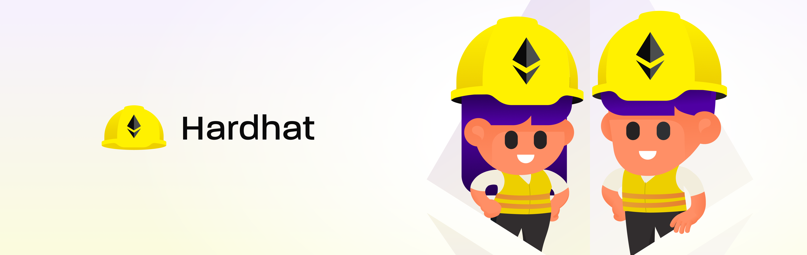

# ERC721コントラクトのデプロイとNFT発行

## 前提知識

* Javascript
* MetaMaskウォレット

## 紹介事項

* Ethereum: イーサリアムの仕組み
* Solidity: イーサリアムのスマートコントラクトで使用する言語
* Dapps: イーサリアムのスマートコントラクトで動かすアプリケーション
* IPFS: 分散型ストレージ
* Hardhat: Solidityの開発ツール（コンパイル、デプロイ）
* MetaMask Javascript API: MetaMaskのEthereum API

## 環境構築


```shell
% node -v
v16.6.1
```



```shell
% yarn init
yarn init v1.22.11
question name (docs.0x3.club): docs.0x3.club
question version (1.0.0): 
question description: 
question entry point (index.js): 
question repository url (https://github.com/keijinamba/docs.0x3.club.git): 
question author: Keiji Namba
question license (MIT): 
question private: 
success Saved package.json
✨  Done in 41.50s.
```


### Hardhatのインストール

<figure><figcaption></figcaption></figure>


**Hardhatとは？**

Hardhatとは、Ethereumソフトウェアをコンパイル、デプロイ、テスト、およびデバッグするための開発環境です。

[https://hardhat.org/](https://hardhat.org/)


Hardhatをインストールしていきます。


```shell
% yarn add -D hardhat
```



nodeのバージョンが違うと以下のエラーが出ます。

<mark style="color:red;">hardhat@2.12.6: The engine "node" is incompatible with this module. Expected version "^14.0.0 || ^16.0.0 || ^18.0.0". Got "19.4.0"</mark>


### Hardhatプロジェクトの初期化

Hardhatを初期化します。今回は、yarnのプロジェクトルートから一段下のサブディレクトリにHardhatのプロジェクトを入れていくので、`Hardhat project root: · /XXX/YYY/hardhat` の部分で/hardhatを追加してます。


```shell
% npx hardhat

888    888                      888 888               888
888    888                      888 888               888
888    888                      888 888               888
8888888888  8888b.  888d888 .d88888 88888b.   8888b.  888888
888    888     "88b 888P"  d88" 888 888 "88b     "88b 888
888    888 .d888888 888    888  888 888  888 .d888888 888
888    888 888  888 888    Y88b 888 888  888 888  888 Y88b.
888    888 "Y888888 888     "Y88888 888  888 "Y888888  "Y888

👷 Welcome to Hardhat v2.12.6 👷‍

✔ What do you want to do? · Create a JavaScript project
✔ Hardhat project root: · /XXX/YYY/hardhat
✔ Do you want to add a .gitignore? (Y/n) · y
✔ Do you want to install this sample project's dependencies with yarn (XXX YYY)? (Y/n) · y

✨ Project created ✨
```


Hardhatプロジェクトが正常に初期化されたかを確認するために、以下のコマンドを打ちます。


```
% npx hardhat --config hardhat/hardhat.config.js test
Downloading compiler 0.8.17
Compiled 1 Solidity file successfully


  Lock
    Deployment
      ✔ Should set the right unlockTime (778ms)
      ✔ Should set the right owner
      ✔ Should receive and store the funds to lock
      ✔ Should fail if the unlockTime is not in the future
    Withdrawals
      Validations
        ✔ Should revert with the right error if called too soon
        ✔ Should revert with the right error if called from another account
        ✔ Shouldn't fail if the unlockTime has arrived and the owner calls it
      Events
        ✔ Should emit an event on withdrawals
      Transfers
        ✔ Should transfer the funds to the owner


  9 passing (960ms)
```


今後 `harthat test` と `hardhat compile` コマンドは多用するので、yarnのコマンドとして打てるようにしておきます。


```json
{
  "scripts": {
    "test": "npx hardhat --config hardhat/hardhat.config.js test",
    "compile": "npx hardhat --config hardhat/hardhat.config.js compile"
  },
}
```


ここまででhardhatの環境構築は完了です。次に、ERC721スマートコントラクトをSolidityを使って実装する際に便利なOpenzeppelinというライブラリをインストールしていきます。

### Openzeppelinのインストール


**Openzeppelinとは？**

「OpenZeppelin」は、Solidityの再利用可能で安全なスマートコントラクトのオープンフレームワークです。

[https://www.openzeppelin.com/](https://www.openzeppelin.com/)


Openzeppelinをインストールしていきます。


```shell
% yarn add -D @openzeppelin/contracts
```


さて、ここまで出来れば開発環境の構築は完了です。実際にSolidityでERC721スマートコントラクトを書いていきましょう。

<figure><figcaption></figcaption></figure>

## ERC721スマートコントラクトを実装
