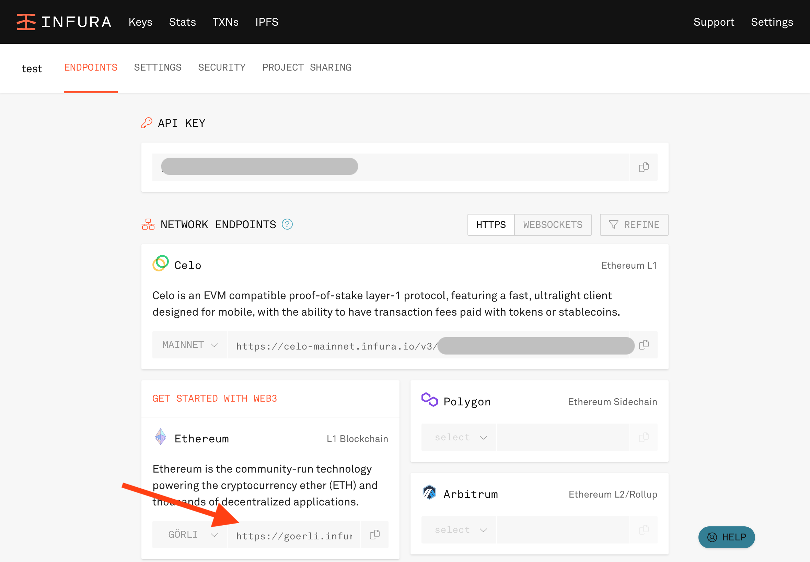

# ERC721コントラクトの実装とデプロイ

## 前提知識

* Javascript
* MetaMaskウォレット

## 紹介事項

* Ethereum: イーサリアムの仕組み
* Solidity: イーサリアムのスマートコントラクトで使用する言語
* Dapps: イーサリアムのスマートコントラクトで動かすアプリケーション
* IPFS: 分散型ストレージ
* Hardhat: Solidityの開発ツール（コンパイル、デプロイ）
* MetaMask Javascript API: MetaMaskのEthereum API

## 環境構築


```shell
% node -v
v16.6.1
```



```shell
% yarn init
yarn init v1.22.11
question name (docs.0x3.club): docs.0x3.club
question version (1.0.0): 
question description: 
question entry point (index.js): 
question repository url (https://github.com/keijinamba/docs.0x3.club.git): 
question author: Keiji Namba
question license (MIT): 
question private: 
success Saved package.json
✨  Done in 41.50s.
```


### Hardhatのインストール

<figure><figcaption></figcaption></figure>


**Hardhatとは？**

Hardhatとは、Ethereumソフトウェアをコンパイル、デプロイ、テスト、およびデバッグするための開発環境です。

[https://hardhat.org/](https://hardhat.org/)


Hardhatをインストールしていきます。


```shell
% yarn add -D hardhat
```



nodeのバージョンが違うと以下のエラーが出ます。

<mark style="color:red;">hardhat@2.12.6: The engine "node" is incompatible with this module. Expected version "^14.0.0 || ^16.0.0 || ^18.0.0". Got "19.4.0"</mark>


### Hardhatプロジェクトの初期化

Hardhatを初期化します。今回は、yarnのプロジェクトルートから一段下のサブディレクトリにHardhatのプロジェクトを入れていくので、`Hardhat project root: · /XXX/YYY/hardhat` の部分で/hardhatを追加してます。


```shell
% npx hardhat

888    888                      888 888               888
888    888                      888 888               888
888    888                      888 888               888
8888888888  8888b.  888d888 .d88888 88888b.   8888b.  888888
888    888     "88b 888P"  d88" 888 888 "88b     "88b 888
888    888 .d888888 888    888  888 888  888 .d888888 888
888    888 888  888 888    Y88b 888 888  888 888  888 Y88b.
888    888 "Y888888 888     "Y88888 888  888 "Y888888  "Y888

👷 Welcome to Hardhat v2.12.6 👷‍

✔ What do you want to do? · Create a JavaScript project
✔ Hardhat project root: · /XXX/YYY/hardhat
✔ Do you want to add a .gitignore? (Y/n) · y
✔ Do you want to install this sample project's dependencies with yarn (XXX YYY)? (Y/n) · y

✨ Project created ✨
```


Hardhatプロジェクトが正常に初期化されたかを確認するために、以下のコマンドを打ちます。


```
% npx hardhat --config hardhat/hardhat.config.js test
Downloading compiler 0.8.17
Compiled 1 Solidity file successfully


  Lock
    Deployment
      ✔ Should set the right unlockTime (778ms)
      ✔ Should set the right owner
      ✔ Should receive and store the funds to lock
      ✔ Should fail if the unlockTime is not in the future
    Withdrawals
      Validations
        ✔ Should revert with the right error if called too soon
        ✔ Should revert with the right error if called from another account
        ✔ Shouldn't fail if the unlockTime has arrived and the owner calls it
      Events
        ✔ Should emit an event on withdrawals
      Transfers
        ✔ Should transfer the funds to the owner


  9 passing (960ms)
```


今後 `harthat test` と `hardhat compile` コマンドは多用するので、yarnのコマンドとして打てるようにしておきます。


```json
{
  "scripts": {
    "test": "npx hardhat --config hardhat/hardhat.config.js test",
    "compile": "npx hardhat --config hardhat/hardhat.config.js compile"
  },
}
```


ここまででhardhatの環境構築は完了です。次に、ERC721スマートコントラクトをSolidityを使って実装する際に便利なOpenzeppelinというライブラリをインストールしていきます。

### Openzeppelinのインストール


**Openzeppelinとは？**

「OpenZeppelin」は、Solidityの再利用可能で安全なスマートコントラクトのオープンフレームワークです。

[https://www.openzeppelin.com/](https://www.openzeppelin.com/)


Openzeppelinをインストールしていきます。


```shell
% yarn add -D @openzeppelin/contracts
```


さて、ここまで出来れば開発環境の構築は完了です。実際にSolidityでERC721スマートコントラクトを書いていきましょう。

<figure><figcaption></figcaption></figure>

## ERC721スマートコントラクトを実装


**ERCとは**

ERCとは「Ethereum Request for Comments」の略で、トークン規格のようなコントラクトの実装を含むアプリケーションレベルでの標準規格です。


アプリケーションレベルでコントラクト実装を標準化するERCにはいくつかの規格が存在します。

#### **ERC20：FT（Fungible Token）を実現するための規格**

最も有名なERC規格です。

標準規格ということは、このERC20を継承したトークンは他のトークンと完全に同じ機能（関数）を有するので、ERC20トークン対応のウォレット（MetaMaskなど）一つでこれら全てのトークンを扱うことができます。

ERC20トークンのように、同種で量が同じであればその価値も同じとなる、通貨と同様のトークンのことをFT（Fungible Token：代替可能トークン）といいます。

#### ERC721：NFT（Non Fungible Token）を実現するための規格

ERC20が同種のトークンであれば同じ価値を持ち互換性があるのに対して、この規格のトークンは一つ一つがユニークで、同じコントラクトの他のトークンと異なる価値を持つことができます。

NFTは`tokenId`というユニークなIDを持つので、イーサリアム上でコントラクトアドレスと`tokenId`のペアはグローバルに一意となります。

### Solidityを実装

以下の場所にNFT用のコントラクトを実装していきます。

```
./hardhat/contracts/SimpleNFT.sol
```

<pre class="language-solidity" data-title="SimpleNFT.sol"><code class="lang-solidity">// SPDX-License-Identifier: MIT
<strong>pragma solidity ^0.8.17;
</strong>
import "@openzeppelin/contracts/token/ERC721/extensions/ERC721URIStorage.sol";
import "@openzeppelin/contracts/utils/Counters.sol";
import "@openzeppelin/contracts/access/Ownable.sol";

contract SimpleNFT is ERC721URIStorage, Ownable {
    using Counters for Counters.Counter;
    Counters.Counter private _tokenIds;

    constructor() ERC721("SimpleNFT", "SN") {}

    function mintNFT(address recipient, string memory tokenURI)
        public
        onlyOwner
        returns (uint256)
    {
        _tokenIds.increment();

        uint256 newItemId = _tokenIds.current();
        _mint(recipient, newItemId);
        _setTokenURI(newItemId, tokenURI);

        return newItemId;
    }
}
</code></pre>

こちらのコードの解説は以下のページで行います。


[solidity.md](solidity.md)


では実際にこのコントラクトをデプロイしてみましょう。

<figure><figcaption></figcaption></figure>

## Solidityをデプロイ

### hardhatの設定

まず、hardhatでデプロイ用のスクリプトを実行する際に便利なライブラリをインストールします。

```shell
% yarn add -D @nomiclabs/hardhat-ethers dotenv
```

そして、`/hardhat/hardhat.config.js`ファイルを以下のように変更します。


```javascript
require("dotenv").config();
require("@nomiclabs/hardhat-ethers");
const { API_URL, PRIVATE_KEY } = process.env;

module.exports = {
  solidity: "0.8.17",
  defaultNetwork: "goerli",
  networks: {
    hardhat: {},
    goerli: {
      url: API_URL,
      accounts: [`0x${PRIVATE_KEY}`],
    },
  },
};
```


ここで、プロジェクトのルートディレクトリに.envファイルを追加し、API\_URLとPRIVATE\_KEYを定義しておきます。


```properties
API_URL=https://goerli.infura.io/v3/XXXXXXXXX
PRIVATE_KEY=XXXXXXXXX
```


#### InfuraからWeb3 API URLを取得

今回はWeb3 APIとしてInfuraを使用します。Alchemyなどでも同様に無料で登録して試せます。

<figure><figcaption></figcaption></figure>

#### MetaMaskウォレットの秘密鍵

MetaMaskの「アカウントの詳細 > 秘密鍵のエクスポート」からウォレットの秘密鍵を取得できます。

<div>

<figure><figcaption></figcaption></figure>

 

<figure><figcaption></figcaption></figure>

</div>

### デプロイ用のスクリプトを記述

`/hardhat/scripts/deploy.js`にデプロイ用のスクリプトを記述していきます。


```javascript
async function main() {
  const SimpleNFT = await ethers.getContractFactory("SimpleNFT");
  const contract = await SimpleNFT.deploy();
  console.log("Contract deployed to address:", contract.address);
}

main()
  .then(() => process.exit(0))
  .catch(error => {
    console.error(error);
    process.exit(1);
  });
```


### デプロイコマンドを実行

次にデプロイ用のコマンドをpackage.jsonに追加します。


```json
{
    "scripts": {
        "deploy": "npx hardhat --config hardhat/hardhat.config.js run hardhat/scripts/deploy.js"
    }
}
```


では実際にdeployコマンドでスクリプトを実行してNFTコントラクトをGoerli上にデプロイしましょう。

```shell
% yarn deploy
yarn run v1.22.11
$ npx hardhat --config hardhat/hardhat.config.js run hardhat/scripts/deploy.js
Contract deployed to address: 0xd232B0121686304A46a80F1a87Ca2a245b54D873
✨  Done in 4.71s.
```

この<mark style="color:purple;">**`0xd232B0121686304A46a80F1a87Ca2a245b54D873`**</mark>と書かれた値が作成されたコントラクトのアドレスになります。こちらは後ほどフロント実装時にも使用するのでメモしておきましょう。

### Etherscanで確認



デプロイしたコントラクトはEtherscan上で確認できます。検索窓に先ほど作成したコントラクトのアドレスを入力しエンターを押します。

「Contract Creation」と書かれたトランザクションが表示されていればデプロイが完了しています。

<figure><figcaption></figcaption></figure>

## Next


[nft-mint-page.md](../nft-mint-page.md)

