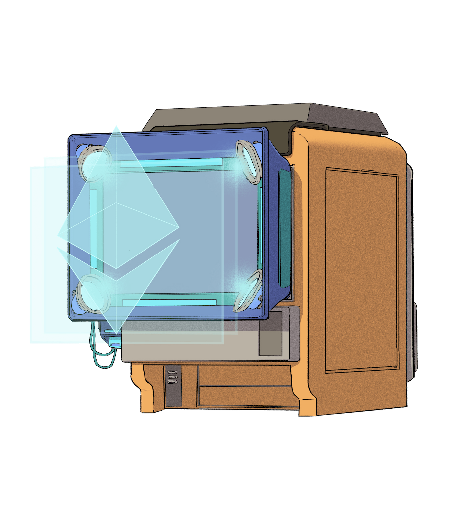

# NFTのミントサイトを作成

## NFTのメタデータをIPFSへアップロード


**IPFSとは**

IPFSとは分散型のストレージサービスです。


今回NFT用のメタデータとして以下のjsonファイルを使用します。


```json
{
    "name" : "Simple NFT First",
    "description" : "My first nft project.",
    "image" : "https://gateway.pinata.cloud/ipfs/QmTnkSuZ1RjzTvTDEB6ho1jVbTUZmYzqSQggMSZmLVjH5j"
}
```


IPFSへのファイルのアップロードは、[pinata](https://www.pinata.cloud/)を使用します。

pinataにログイン後、アップロードボタンからファイルを選択してIPFSへアップロード出来ます。

<figure><figcaption></figcaption></figure>

<figure><figcaption></figcaption></figure>

アップロードが完了すれば、IPFS上に展開されたファイルのURLが取得できます。

[https://gateway.pinata.cloud/ipfs/QmYZMM98nNya8BGkvwrhHUAdx57wApgs1gsp3D5qUo5Edc](https://gateway.pinata.cloud/ipfs/QmYZMM98nNya8BGkvwrhHUAdx57wApgs1gsp3D5qUo5Edc)

これが今回NFTのメタデータとしてSimpleNFTコントラクトのmintNFTメソッドに渡すtokenURIになります。


対象となるNFTの画像自体もpinata上にアップロードし、IPFS上のURLを取得した上でJsonファイルのimageに渡しています。


## ミントサイトを作成

browserifyを使ってJavascriptのモジュールをrequire出来るようにします。

```shell
% yarn add -D browserify
```

さらに、今回コントラクトを扱うためにweb3.jsを使用するのでこちらもインストールします。

```shell
% yarn add -D web3
```

それでは、/webディレクトリ上にwebページで表示するためのファイルを実装していきます。

### index.htmlの実装

`/web/index.html`にhtmlファイルを作成します。

今回、スタイルはTailwind CSSを使っています。


```html
<!doctype html>
<html>
<head>
  <meta charset="UTF-8">
  <meta name="viewport" content="width=device-width, initial-scale=1.0">
  <script src="https://cdn.tailwindcss.com"></script>
  <style>
    body {
      height: 100vh;
    }
  </style>
</head>
<body>
  <div class="flex min-h-full items-center justify-center py-12 px-4 sm:px-6 lg:px-8">
    <div class="w-full max-w-md space-y-8">
      <div>
        <h2 class="mt-6 text-center text-3xl font-bold tracking-tight text-gray-900">Let's mint a SimpleNFT</h2>
      </div>
      <button id="mint-button" class="group relative flex w-full justify-center rounded-md border border-transparent bg-indigo-600 py-2 px-4 text-sm font-medium text-white hover:bg-indigo-700 focus:outline-none focus:ring-2 focus:ring-indigo-500 focus:ring-offset-2">
        Mint
      </button>
    </div>
  </div>
  <script src="./bundle.js"></script>
</body>
</html>
```


### main.jsの実装

`/web/main.js`にJavascriptのファイルを作成します。

このファイルは後ほどbrowserifyを使用してブラウザで使用できる形にコンパイルし、コンパイル後のファイル（bundle.js）をhtmlファイルから読み込んでいます。


```javascript
const NFTContract = require("../hardhat/artifacts/contracts/SimpleNFT.sol/SimpleNFT.json");
const Web3 = require("web3");

const { ethereum } = window;
const web3 = new Web3(ethereum);

const CONTRACT_ADDRESS = "0xd232B0121686304A46a80F1a87Ca2a245b54D873";
const TOKEN_URI = "https://gateway.pinata.cloud/ipfs/QmYZMM98nNya8BGkvwrhHUAdx57wApgs1gsp3D5qUo5Edc";

window.addEventListener("DOMContentLoaded", () => {
  const button = document.getElementById("mint-button");
  button.addEventListener("click", async () => {
    const [walletAddress] = await ethereum.request({
      method: "eth_requestAccounts",
    }).catch(console.error);
    
    console.log("walletAddress", walletAddress);

    const abi = NFTContract.abi;
    const contract = new web3.eth.Contract(abi, CONTRACT_ADDRESS);
    const data = contract.methods.mintNFT(walletAddress, TOKEN_URI).encodeABI();

    const transaction = {
      from: walletAddress,
      to: CONTRACT_ADDRESS,
      data
    };

    const txHash = await ethereum.request({
      method: "eth_sendTransaction",
      params: [transaction],
    }).catch(console.error);
    
    console.log("txHash", txHash);

    alert(`NFT minted! Transaction Hash: ${txHash}`)
  });
});
```



**CONTRACT\_ADDRESS**

[コントラクトのデプロイ時](erc721-deploy/#depuroikomandowo)に取得したGoerli上にデプロイされたNFTコントラクトのアドレスを指定します。



**TOKEN\_URI**

上記でpinataにアップロードしたJsonファイルのIPFS URLを指定します。


## 発行されたNFTを確認

### Etherscanで確認

Etherscanでデプロイしたコントラクトのトランザクション履歴を見ると、**`Mint NFT`**と書かれているトランザクションが追加されているのがわかります。

<figure><figcaption></figcaption></figure>

### Openseaのテストネットで確認

Openseaにはテストネットで動作確認などを行えるステージング環境のようなものがあります。（[https://testnets.opensea.io/](https://testnets.opensea.io/ja/account)）



こちらに同じウォレットでログインしてマイページに行くと、Goerliなどのテストネットで自分の持っているNFTが一覧表示されるので、先ほど発行したSimple NFTがきちんと表示されているのが分かります。

<figure><figcaption></figcaption></figure>

以上で、スマートコントラクトのデプロイからNFTのミントサイト作成までが完了です。

<figure><figcaption><p><em>Congratulations</em>!</p></figcaption></figure>
